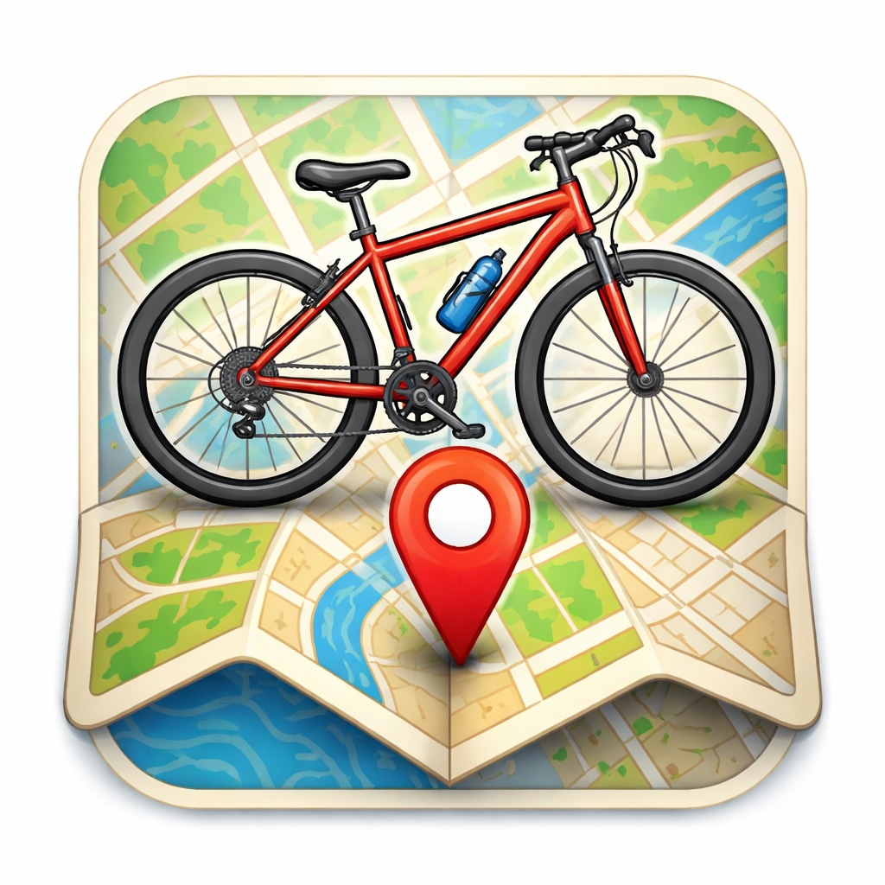

# BikeGPS

> 🇮🇹 [Versione italiana](README.md)

A DIY real-time GPS display for cyclists — an iPhone app sends your position and turn-by-turn navigation to a tiny ESP32 screen mounted on the handlebar via Bluetooth Low Energy.



▶️ **[See it in action on Instagram](https://www.instagram.com/reel/DYcmjXJIwDb/)**

> **⚠️ Prototype v1** — this is a personal project at its first public release. It works, but there is plenty of room for improvement: hardware, firmware, app, 3D mount. Any suggestion, bug report, pull request or idea is welcome. The project is meant to grow with the community.

> **📱 iOS note** — due to Apple restrictions, the iPhone app needs to be recompiled from Xcode every 7 days (free developer account). It's inconvenient but there is no alternative without paying €99/year. [→ Full sideloading guide](docs/ios-sideloading.md). An **Android version** is in the works and will not have this problem.

---

## What you need

Three physical things + an iPhone:

| # | What | How to get it |
|---|------|---------------|
| 1 | **Waveshare ESP32-C6-Touch-LCD-1.47** *(touch version!)* | [AliExpress](https://www.aliexpress.com/item/1005009816465254.html) ~$13–15 |
| 2 | **3D-printed handlebar mount** | Print the STEP file in `3d-mounts/` (PETG/ASA, ~2h) |
| 3 | **microSD card ≥ 4 GB** (Class 10) with offline map tiles | Any — tiles loaded via `tools/prepare_sd.py` |
| 4 | **iPhone** (iOS 16+) | — |

> ⚠️ **Buy the TOUCH version** of the ESP32 module — the non-touch version has different GPIO pins and the firmware will not work on it.

No soldering, no extra wiring. The ESP32-C6 module includes display, touch, BLE, and SD slot on a single board.

---

## What it does

| Feature | Details |
|---|---|
| **Live map tile** | OSM or Esri satellite tiles pre-loaded on SD card, no internet needed while riding |
| **Speed + compass** | Real-time from iPhone GPS, displayed in large digits |
| **Turn-by-turn nav** | Search a destination on the iPhone → ESP32 shows arrow + distance + voice guidance |
| **Rerouting** | Automatically recalculates if you take a wrong turn |
| **Temperature** | ESP32 chip temperature sensor shown on screen |
| **Touch to zoom** | Tap top half of screen → toggle between z15 (detail) and z14 (overview) |
| **Touch to change view** | Tap bottom half → cycle Speed / Map+Info / Full Map / Satellite / Night |

---

## Power

The Waveshare ESP32-C6 module is powered via **USB-C at 5V** (the same port used for programming).

### Current setup: e-bike controller USB port

If you have an **e-bike with a USB port on the handlebar controller** (such as Haibike with a Yamaha motor), a simple **USB micro → USB-C cable** is all you need: the bike powers the module when switched on and cuts power when switched off. No extra components, no batteries to charge.

### Alternatives for bikes without a USB port

| Solution | Best for | Notes |
|---|---|---|
| **Powerbank** (5000 mAh, ~100g) | Any bike | Simplest option — lasts days, recharged via USB-C |
| **LiPo 500 mAh + TP4056** | Integrated into mount | ~4h runtime (ESP32 draws ~100–150 mA with display active) |
| **Buck converter 36/48V → 5V** | E-bike without USB port | Wired directly to the battery, always on with the bike |

> 💡 **Want to contribute?** Power supply is one of the most open areas of the project. Interesting directions to explore: mount with integrated LiPo and wireless charging, integration with the Yamaha/Bosch e-bike CAN bus. Any proposal, schematic or prototype is welcome.

---

## 3D-printed handlebar mount

The `3d-mounts/` directory contains a STEP file for a handlebar mount:

```
3d-mounts/
├── bikegps_mount_v1.step   ← first prototype (STEP AP214)
└── README.md               ← print settings + hardware list
```

> **⚠️ Prototype v1** — it works but there is probably room for improvement. Modifications, variants and alternative versions are very welcome.

**Hardware required:**
- 4× **M2.5** screws (~6 mm) — to mount the LCD module to the tray
- 2× **M4** bolts (~20 mm) + nut — C-clamp on the handlebar

**Ball joint assembly:** the ball is a separate printed part. Insert the M4 nut into the joint first, then glue the ball to the Waveshare module bracket (epoxy or super glue). Do not glue before inserting the nut — you won't be able to close the joint afterwards.

Print in PETG or ASA (UV/weather resistant), 40% infill.

---

## Architecture

```
┌──────────────────────────────────────┐
│          iPhone (iOS app)            │
│  CoreLocation → GPS coordinates      │
│  MapKit       → turn-by-turn routing │
│  AVFoundation → Italian voice nav    │
│  Sends JSON via BLE NUS every ~1 s   │
└──────────────────┬───────────────────┘
                   │ Bluetooth LE (Nordic NUS)
                   │ {"lat":…,"lon":…,"speed":…,
                   │  "heading":…,"nav":1,"ndist":120}
┌──────────────────▼───────────────────┐
│     Waveshare ESP32-C6 (firmware)    │
│  BLE receive  → parse JSON           │
│  SD card      → load map tile (JPEG) │
│  JPEGDEC      → decode to RGB565     │
│  Arduino_GFX  → 172×320 IPS display  │
│  Touch AXS5106L → gesture handling   │
└──────────────────────────────────────┘
```

BLE packet example:
```json
{
  "lat": 41.9028, "lon": 12.4964,
  "speed": 23.5,  "heading": 275.0,
  "time": "14:32", "alt": 47.0,
  "bat": 0.87,
  "nav": 1, "ndist": 350, "nst": "Via Nazionale"
}
```
`nav` values: `-1` = off · `0` = straight · `1` = right · `2` = left · `3` = U-turn · `4` = arrived

---

## Repository structure

```
bikeesp32gps/
├── esp32-firmware/
│   └── bikegps_v3/
│       └── bikegps_v3.ino      ← main Arduino sketch (all-in-one)
├── iphone-app/
│   ├── project.yml             ← XcodeGen spec (run to regenerate .xcodeproj)
│   └── BikeGPS/
│       ├── BikeGPSApp.swift
│       ├── ContentView.swift
│       ├── Views/
│       │   └── MapNavView.swift
│       └── Managers/
│           ├── LocationManager.swift
│           ├── BLEManager.swift
│           ├── NavigationManager.swift
│           └── GPSTransmitter.swift
├── tools/
│   ├── prepare_sd.py           ← interactive wizard: city search, zoom, layer → tiles on SD
│   └── download_tiles.py       ← advanced CLI: direct bbox/region/lat-lon download
├── docs/
│   └── ios-sideloading.md      ← step-by-step Xcode guide + 7-day workaround (Italian)
└── 3d-mounts/                  ← STEP files for handlebar mount
```

---

## Setup: ESP32 firmware

### 1. Install arduino-cli (or Arduino IDE 2.x)

```bash
brew install arduino-cli
arduino-cli core install esp32:esp32
```

### 2. Install libraries

```bash
arduino-cli lib install "Arduino_GFX_Library"
arduino-cli lib install "JPEGDEC"
arduino-cli lib install "ArduinoJson"
arduino-cli lib install "ESP32 BLE Arduino"
```

Also install **esp_lcd_touch_axs5106l** manually — download from [this repo](https://github.com/waveshareteam/ESP32-C6-Touch-LCD-1.47) and place it in `~/Documents/Arduino/libraries/`.

### 3. Compile and flash

```bash
# Compile
arduino-cli compile \
  --fqbn esp32:esp32:esp32c6:CDCOnBoot=cdc \
  esp32-firmware/bikegps_v3/

# Flash (adjust port as needed — /dev/cu.usbmodem* on macOS)
arduino-cli upload \
  -p /dev/cu.usbmodem1101 \
  --fqbn esp32:esp32:esp32c6:CDCOnBoot=cdc \
  esp32-firmware/bikegps_v3/
```

---

## Setup: SD card maps

The firmware loads map tiles from the SD card at `/tiles/{zoom}/{x}/{y}.jpg` (OSM slippy map format). You pre-load an area before your ride — no internet needed while cycling.

### Wizard (recommended)

`tools/prepare_sd.py` is an interactive wizard that guides you through four steps:

```bash
pip3 install Pillow        # one-time install (needed for JPEG conversion)
python3 tools/prepare_sd.py
```

**Step 1 — Where?**
Pick from predefined regions or type any city name. The wizard geocodes it automatically and asks you to confirm if multiple results are found.

**Step 2 — How much area?**

| Profile | Zoom | Radius | Approx. size |
|---------|------|--------|--------------|
| City only | 15 | ~6 km | 30–60 MB |
| Day trip | 14 + 15 | ~15 km | 80–200 MB |
| Full region | 14 + 15 | full region bbox | varies |
| Wide area | 13 + 14 | full region bbox | lighter, less detail |

**Step 3 — Map style?**
- Road map — OpenStreetMap tiles, ideal for navigation
- Satellite — Esri World Imagery aerial tiles, heavier files
- Both — downloads both sets

**Step 4 — SD card path?**
The wizard auto-detects removable volumes on macOS (`/Volumes/*`) and shows free space. Pick one from the list or enter a path manually.

After the four steps the wizard shows a summary — tile count, estimated MB and estimated download time — before asking for confirmation. The download is resumable: re-running skips tiles that already exist.

### Advanced CLI (scripted / CI use)

If you prefer flags over prompts, `download_tiles.py` takes everything on the command line:

```bash
# Predefined region
python3 tools/download_tiles.py \
  --region lazio --zoom 14,15 --layer map \
  --out /Volumes/SDCARD/tiles

# Custom area around a point
python3 tools/download_tiles.py \
  --lat 43.7696 --lon 11.2558 --radius 15 \
  --zoom 14,15 --layer sat \
  --out /Volumes/SDCARD/tiles

# Dry-run: count tiles without downloading
python3 tools/download_tiles.py \
  --region lazio --zoom 14,15 --dry-run
```

Both tools save tiles at the path the firmware expects:
- Road map → `/tiles/{z}/{x}/{y}.jpg`
- Satellite → `/tiles/sat/{z}/{x}/{y}.jpg`

> **Note:** tiles must be **baseline JPEG**, not progressive — JPEGDEC on the ESP32 does not support progressive JPEG. Both tools handle this conversion automatically when Pillow is installed. If you add tiles manually, convert them first: `sips -s format jpeg *.jpg --out .`

---

## Setup: iPhone app

> 📖 **Detailed guide (with troubleshooting and the 7-day workaround):** [docs/ios-sideloading.md](docs/ios-sideloading.md) *(Italian)*

### 1. Install XcodeGen

```bash
brew install xcodegen
```

### 2. Generate and open the project

```bash
cd iphone-app
xcodegen generate
open BikeGPS.xcodeproj
```

### 3. Sign and install

1. In Xcode → BikeGPS target → **Signing & Capabilities** → set your Apple ID as Team.
2. Change `com.yourname.bikegps` to any unique bundle ID.
3. Plug in your iPhone, select it as destination, press ▶.
4. First run: **Settings → General → VPN & Device Management → [your Apple ID] → Trust**.

> Free developer accounts expire after 7 days — re-run from Xcode to refresh.

---

## Troubleshooting

| Symptom | Fix |
|---|---|
| Screen blank | Check USB-C connection; hold BOOT + press RESET to enter download mode |
| Display garbage on first boot | The `lcd_reg_init()` call in the sketch is mandatory for the JD9853 driver — make sure it's not commented out |
| BLE not connecting | Grant Bluetooth permission in iOS Settings; kill and reopen the app |
| No location data | Settings → Privacy → Location → BikeGPS → **Always** |
| Map shows grey tiles | SD card not mounted; check SPI.begin(1,3,2,4) precedes SD.begin(4) in setup() |
| JPEG decode fails | Files must be **baseline JPEG** (not progressive). Re-convert: `sips -s format jpeg *.jpg` |
| macOS copies `._` files to SD | Safe to delete. On macOS: `dot_clean /Volumes/SDCARD` |
| Nav doesn't reroute | Make sure iPhone has network access (MapKit needs it for rerouting) |

---

## Contributing (including vibe-coders 🤙)

This project was built with a mix of Arduino C++ and Swift, largely through AI-assisted coding sessions. **You don't need to be an expert** — if you use Claude Code, Cursor, or similar tools, here's how to get up to speed fast:

### Quick context for your AI assistant

Paste this into your first message:
```
I'm working on BikeGPS — an ESP32-C6 + iPhone BLE GPS display.
Hardware: Waveshare ESP32-C6-Touch-LCD-1.47 (TOUCH version).
Pins: LCD SPI SCK=1 MOSI=2 CS=14 DC=15 RST=22 BL=23
      SD: MISO=3 CS=4 (shares SCK+MOSI with LCD)
      Touch I2C: SDA=18 SCL=19 RST=20 INT=21
Display: 172×320 IPS, Arduino_GFX_Library + custom lcd_reg_init() required.
BLE: Nordic NUS profile, JSON packets, built-in ESP32 BLE library.
iPhone: SwiftUI, CoreLocation, MapKit routing, AVSpeechSynthesizer.
```

### Good first issues to tackle

- [ ] Nighttime map tiles (darker palette, less glare)
- [ ] Show elevation profile on the map
- [ ] Speed limit display (using OSM data)
- [ ] Android companion app
- [ ] Widget for iPhone Lock Screen showing current speed
- [ ] Battery-level optimisation (dim display when stationary)
- [ ] Multi-language navigation voice (currently Italian only)
- [ ] Alternative power solutions (integrated LiPo in mount, buck converter from e-bike battery)

### How to submit changes

1. Fork the repo
2. Make your change (AI-assisted is totally fine)
3. Test on real hardware if you can, or describe what you tested
4. Open a PR — describe what you changed and why

No formal code review process. If it works and doesn't break existing features, it goes in.

---

## License

MIT — free to use, modify, build, and sell.  
OpenStreetMap tiles © OpenStreetMap contributors (ODbL).  
Esri satellite tiles © Esri, Maxar, GeoEye (free for non-commercial use under Esri's standard terms).
